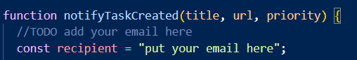
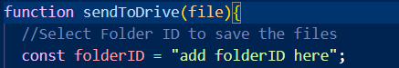
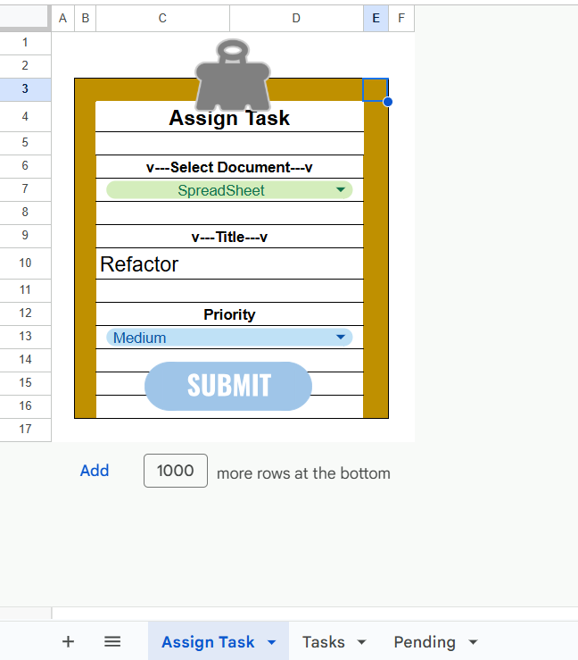
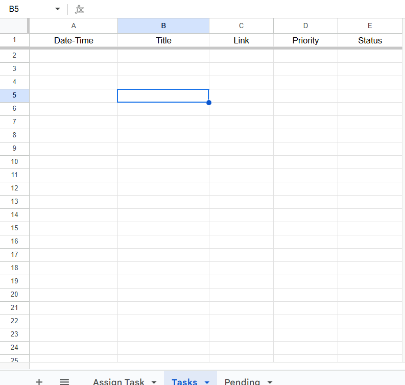
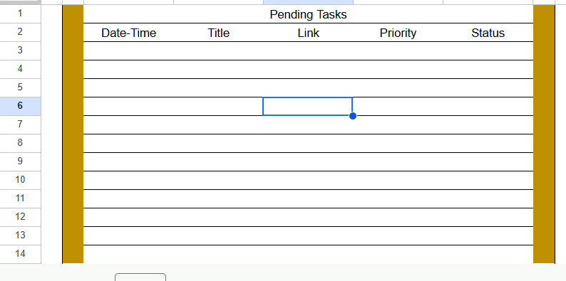

# Task-Manager
Google App Script/Clasp/Spreadsheet Task Manager

This is a simple Task Manager system made in Google SpreadSheets

Put the email you want to send notifs here.

Put the Drive folder ID of where you want to save the documents.

Assign Task sheet design

Tasks sheet

Pending Tasks
